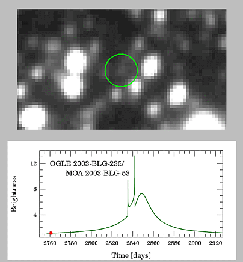

# 微透镜侦探 · Microlensing Detective

引力微透镜（gravitational microlensing）光变曲线互动演示 —— 一个纯前端、零依赖的教学玩具：左边看光线如何被透镜弯曲，右边看光变如何被记录，还能化身"侦探"从 noisy 观测数据里反推出隐藏的透镜参数。



## 功能一览

| 模块 | 说明 |
| --- | --- |
| 🔭 **光线偏折侧视图** | 源星 → 透镜平面 → 观测者的光路示意；光线粗细 ∝ 像的放大率 μ，虚线示像的视位置 |
| 📈 **光变曲线 + Mock 观测** | OGLE 风格事件展示；σ = 2% 高斯噪声 + 18% 天气随机缺数，支持 1× / 3× / 10× 播放与完整事件回看 |
| 🗺 **投影视图** | 源居中的天区示意：绿虚线＝爱因斯坦环参考位置，蓝点＝像（大小 ∝ 放大率） |
| 🎚 **参数沙盒** | 实时调节 t₀、u_min（精度 0.001 R_E）、t_E、f_s（混光）、q（行星质量比）、s（投影分离） |
| 🎯 **谜题挑战模式** | 隐藏一套"真值"参数生成观测数据，你用滑块拟合，χ²/dof → 1 后公布答案，逐项判定 t₀ / u_min / t_E / f_s / q / s 是否在容差内 |
| 📖 **知识卡图鉴** | 6 张知识卡（Paczyński 曲线、爱因斯坦环、混光、焦散线、找行星……），通过触发特定物理条件解锁，进度存于 localStorage |

## 物理模型

- **单透镜（1L1S）**：Paczyński 解析解 `A(u) = (u²+2) / (u·√(u²+4))`，像位置与放大率闭式计算
- **双透镜（恒星 + 行星/伴星）**：透镜方程化为五次复多项式，Durand–Kerner 法求全部根 + Newton 迭代精修 + 假根过滤；像数 3 ↔ 5，含焦散线（caustic）绘制，源穿越时放大率剧烈跳变
- **观测模拟**：点源近似、放大率上限 1000；噪声 σ = 2%·√F，天气缺数率 18%

> 光线弯曲为示意画法——真实偏折角在毫角秒量级；像间距同样无法分辨，这正是微透镜只测"亮度随时间变化"的原因。

## 快速开始

无需构建、无需安装依赖，任选其一：

```bash
# 方式一：直接用浏览器打开 index.html

# 方式二：用自带静态服务器（no-store，方便开发调试）
python3 server.py
# → http://localhost:8765
```

## 运行测试

Node.js 冒烟测试覆盖解析解、五次方程求解器、双透镜极限（s→0 / q→0）、假根过滤、焦散线、观测模拟与谜题判定：

```bash
node test/smoke.test.mjs
```

## 项目结构

```
microlensing-demo/
├── index.html            # 页面骨架（三栏布局：主区 + 侧栏）
├── css/style.css         # 暗色主题样式
├── js/
│   ├── physics.js        # 复数运算、透镜方程求解、光变/观测模拟
│   ├── render.js         # 三个画布视图（光路 / 光变曲线 / 投影）
│   ├── ui.js             # 滑块、日志、toast、模态框
│   ├── knowledge.js      # 知识卡内容
│   ├── puzzle.js         # 谜题生成、χ² 与判定
│   └── main.js           # App 状态机与动画循环
├── test/smoke.test.mjs   # Node 冒烟测试
├── server.py             # no-cache 静态服务器（端口 8765）
└── anim1.gif             # 演示动图
```

## 参考

- Paczyński 1986, ApJ 304, 1 — 单透镜光变曲线
- Paczyński 1996, ARA&A 34, 419 — 微透镜综述
- Mao & Paczyński 1991; Gould & Loeb 1992 — 微透镜找行星
- Erdl & Schneider 1993 — 双透镜焦散线
